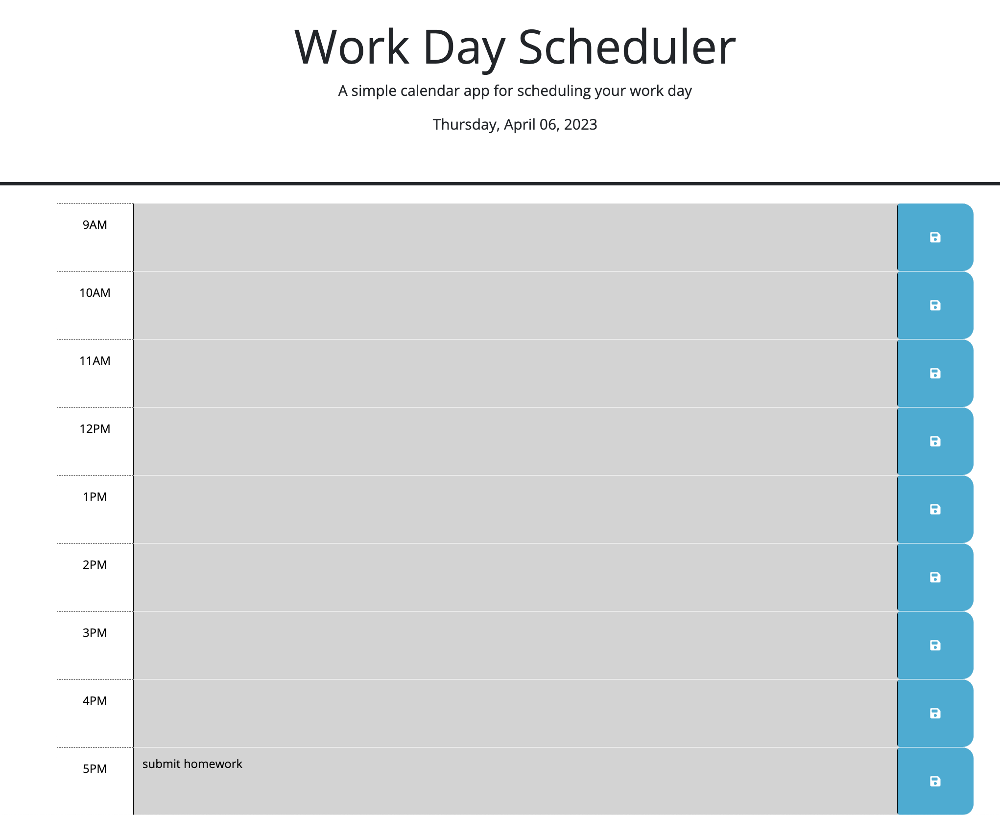

# Challenge 05 - Work Day Scheduler

## Description

A Work Day Scheduler built with jQuery and Day.js.

## Installation

N/A

## Usage

Access the website at https://aerostokes.github.io/work-day-scheduler/ 

The current date will be displayed in the header and the time blocks will update every hour to show future time in green, present time in red, and past time in grey. 

After entering details into the time blocks, the save buttons will change to red to indicate that a save is needed. Click the corresponding save button to save the info to local storage so that your info will be remembered even if the browser is closed. 

## Credits

N/A

## License

See repo.
